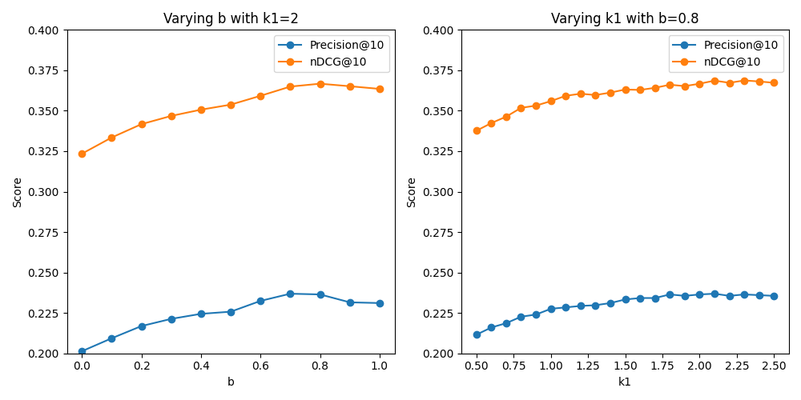

# CS 410 MP 1
Kalvin Yang (kairany2)

## Section 1: Implementing BM25
This section experimented the **Cranfield** text collection against the BM25 algorithm provided by Pyserini's built-in Lucene searcher. To gauge the optimal parameter set for BM25, an experiment that conducts multiple searches against various set of parameters *(k1, b)* was implemented, and the result follows:

In this experiment, two distinct metrics were employed: the nDCG@10 metric and the Precision@10 metric. This version of Precision@10 treats relevance=1 and above as *relevant*, and only relevance=0 as *non-relevant*. This threshold ensures that weak-relevant document can be distinguished from irrelevant document in the data collection, which is a design choice I made to address exploratory browsing for users, and provide them variety of results. 

The hyperparameter tuning process investigates the effect of varying one hyperparameter while controlling the other to study how each individual hyperparameter affects the retrieval metrics (nDCG and Precision). From the figures, it is obvious that both nDCG and Precision increases as b or k1 increase, until the interval of b > 0.8 and k1 > 2, where both of the metrics begin to stay constant and start to decline.  

The optimal b value is around 0.8, this value greatly account for document length normalization, which weighs long document similarly as short document to search for query-document similarity. The optimal k1 value is around 2, where term (word) frequency is moderately rewarded in the search but not too much to overaccount common filler English words. This suggests that documents in the collection are balanced in word distribution and having various document lengths, so they can benefit from both term frequency and length normalization in retrieval.

The trend of nDCG@10 and precision@10 varying by b and k1 are almost identical, which means despite nDCG has a relatively complex formula compare to naive precision, they gauge search accuracy in a similar fashion -- give high score for searching highly relevant documents, and give low score for bringing non-relevant document to the result. 

## Section 2: Comparing Search Algorithm Performance
This section explores searching algorithms other than BM25 to interpret which algorithm suits best for this particular dataset. 
In particular, two additional algorithms based on relevance feedback are implemented in Lucene to experiment -- RM3 and Rocchio.
Despite both RM3 and Rocchio being relevance feedback algorithms, they are slightly different -- RM3 is a probabilistic query expansion algorithm based on frequency analysis of top frequent terms and measures its relevance based on query likelihood, while Rocchio is a vector-space model that iteratively adjust the new query vector based on the feedback of positive-negative document results to achieve better search in the next time. 

We will measure the performance across algorithms in nDCG@10 because it is a complex metric accounting in diminishing document ranking. For the performance on *Cranfield* dataset, all of three algorithms are similar, with naive BM25 (b=0.8, k1=2) having nDCG of 0.3667. The RM3 hyperparameter setting is fetching top-10 terms for re-weighing and top-10 documents since topk=10, and weighing new terms and old query the same (old query=0.5). This yields nDCG of 0.3647, slightly less than BM25. The Rocchio hyperparameter re-weighs top-5 documents and top-5 terms as well as bottom-5 documents and bottom-5 terms, with alpha=1, beta=0.75 and gamma=0. This setting weighs the original query same impact like RM3, and favors relative documents but does not penalize irrelevant documents for simplicity. The Rocchio nDCG is 0.3612, even smaller than RM3. The reason why naive BM25 performs the best in the dataset could be attributed to simplicity design and relatively optimized parameters (in Section 1). To optimize RM3 and Rocchio hyperparameters are usually daunting and requires extensive time, so I only plug in recommended hyperparameters for it. This added layer of complexity adversely impacted the algorithm to result in lower metrics. 

## Section 3: Comparing Search Algorithm Performance in another dataset
In this section, we completed our search algorithm assessment in a separate dataset called *new_faculty*, which contains over 7000 documents of CS410 related information. Despite almost 5 times more data than Cranfield, the result of three algorithms ranking remained the same -- BM25 got the top in the nDCG@10 metric ranking, with 0.4752 significantly larger than RM3's 0.4483 and Rocchio's 0.4415. We can also inspect that adding complexity usually would not lead to better performance. The complex Rocchio algorithm got the lowest of the three, while the moderately complex RM3 has the second lowest. The gap between relevance feedback algorithms and BM25 also explains that the hyperparameters of algortihms varied by the dataset the search is performed on. For each new dataset, there exists an optimal hyperparameter set uncovered from extensive analysis and computing, so that plugging in default values are not a recommended approach.